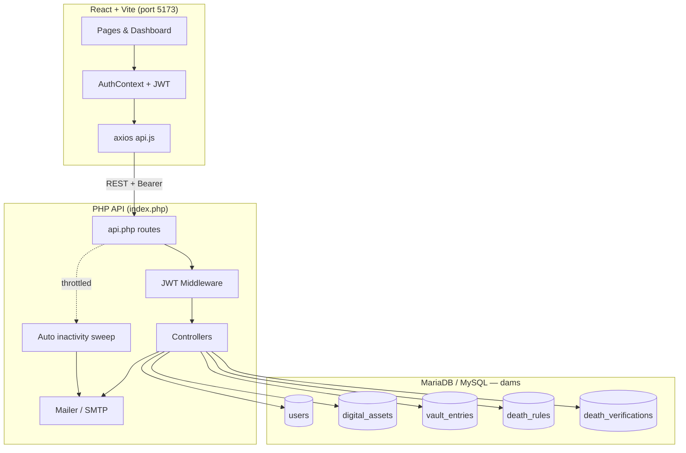
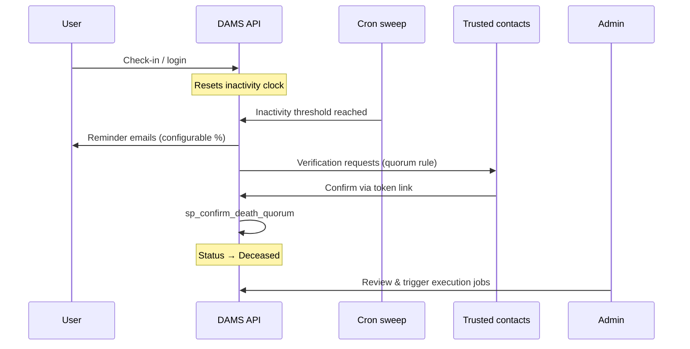

<div align="center">


<br />

# Digital Afterlife Management System

### Plan your digital legacy. Protect what matters. Execute with care.

[](https://react.dev/)
[](https://vitejs.dev/)
[](https://www.php.net/)
[](https://mariadb.org/)
[](https://github.com/firebase/php-jwt)

<br />

**DAMS** helps users catalog encrypted digital assets, designate trusted contacts and beneficiaries, and define **death rules** (inactivity timers, quorum verification, or both) so inheritance workflows can run safely when the time comes.

<br />

[Features](#features) · [Architecture](#architecture) · [Quick Start](#quick-start) · [Configuration](#configuration) · [API](#api-overview) · [Database](#database)

</div>

---

## Overview

Modern life leaves behind passwords, accounts, crypto wallets, subscriptions, and files scattered across providers. **DAMS** centralizes that footprint in an encrypted vault, pairs it with **trusted-contact quorum** verification, and automates **inactivity monitoring** so your wishes can be honored without leaving loved ones locked out.

<table>
<tr>
<td width="50%" valign="top">

**For account holders**

- Register and authenticate with JWT sessions
- Add digital assets with encrypted vault fields
- Assign beneficiaries and delivery instructions
- Configure inactivity + quorum death rules
- Receive reminder emails as inactivity grows

</td>
<td width="50%" valign="top">

**For operators & contacts**

- Admin dashboard: users, verifications, executions
- Quorum-based death confirmation workflow
- Automated inactivity sweep (built-in or cron)
- SMTP notifications across the lifecycle
- Audit-friendly status transitions in MySQL

</td>
</tr>
</table>

---

## Features

<details open>
<summary><strong>Core capabilities</strong></summary>
<br />

| Area | What you get |
|------|----------------|
| **Digital vault** | Bank, crypto, social, email, storage, subscriptions, domains, and custom assets |
| **Encryption** | Per-field vault entries with IV-backed ciphertext at rest |
| **Beneficiaries** | Share splits, contact details, and special instructions per asset |
| **Death rules** | Inactivity timer, trusted-contact quorum, or combined (AND) logic |
| **Check-ins** | Activity logging resets inactivity; triggers cancel open verifications |
| **Reminders** | Percent-of-threshold custom messages before a rule fires |
| **Admin console** | User oversight, death verifications, pending executions, inheritor notify |
| **Dashboard** | KPIs, recent activity, asset summaries, and account status at a glance |

</details>

<details>
<summary><strong>Supported asset types</strong></summary>
<br />

`bank_account` · `crypto_wallet` · `social_media` · `email` · `file_storage` · `subscription` · `domain` · `other`

</details>

<details>
<summary><strong>Account lifecycle</strong></summary>
<br />

```
Active → Flagged → Pending_Verification → Deceased → Executed
```

Check-ins and admin actions can move users back toward **Active** when appropriate. Stored procedures such as `sp_confirm_death_quorum` coordinate quorum confirmations and status transitions.

</details>

---

## Architecture



### Death-rule flow (simplified)



---

## Tech stack

| Layer | Technologies |
|-------|----------------|
| **Frontend** | React 19, React Router 7, Vite 8, axios, jwt-decode, xlsx |
| **Backend** | PHP 8+, Composer, firebase/php-jwt, vlucas/phpdotenv |
| **Database** | MariaDB / MySQL — triggers, views, stored procedures |
| **Security** | JWT auth, encrypted vault fields, cron token, CORS for local dev |
| **Ops** | XAMPP / Apache or `php -S`, optional Task Scheduler cron |

---

## Project structure

```
digital-afterlife-management-system/
├── client/                    # React + Vite SPA
│   ├── src/
│   │   ├── pages/             # Dashboard, Assets, Contacts, Admin, Auth
│   │   ├── components/      # AppLayout, Sidebar
│   │   ├── context/           # AuthContext (JWT)
│   │   └── utils/api.js       # API base URL from .env
│   └── package.json
├── server/                    # PHP REST API
│   ├── index.php              # Entry + auto cron sweep
│   ├── src/
│   │   ├── routes/api.php
│   │   ├── controllers/
│   │   ├── middleware/
│   │   └── utils/             # Crypto, Mailer, Http
│   ├── migrations/            # Ordered SQL migrations
│   └── composer.json
└── README.md
```

---

## Quick start

### Prerequisites

- **Node.js** 18+ and npm
- **PHP** 8.0+ with `pdo_mysql`, Composer
- **MariaDB / MySQL** 10.4+
- **XAMPP** (optional) or PHP built-in server

### 1 — Database

```bash
# Create database, then import schema + migrations (order matters)
mysql -u root -p -e "CREATE DATABASE IF NOT EXISTS dams CHARACTER SET utf8mb4 COLLATE utf8mb4_unicode_ci;"
mysql -u root -p dams < server/migrations/dams.sql
mysql -u root -p dams < server/migrations/001_users_country_recovery.sql
mysql -u root -p dams < server/migrations/002_users_is_admin.sql
mysql -u root -p dams < server/migrations/003_inactivity_reminders.sql
mysql -u root -p dams < server/migrations/004_system_hardening.sql
```

<details>
<summary><strong>Alternative: phpMyAdmin</strong></summary>
<br />

1. Create database `dams`
2. Import `server/migrations/dams.sql`
3. Run migrations `001` → `004` in order

</details>

### 2 — Backend

```bash
cd server
composer install
# Create server/.env from the Configuration table below
```

**Option A — PHP built-in server**

```bash
cd server
php -S localhost:8000
# API base: http://localhost:8000
```

**Option B — XAMPP / Apache**

Serve the repo under `htdocs`, e.g.:

`http://localhost/digital-afterlife-management-system/server`

### 3 — Frontend

```bash
cd client
npm install
```

Create `client/.env`:

```env
# Built-in PHP server
VITE_API_BASE_URL=http://localhost:8000

# XAMPP example
# VITE_API_BASE_URL=http://localhost/digital-afterlife-management-system/server
```

```bash
npm run dev
```

Open **http://localhost:5173** — sign up, log in, and explore the dashboard.

---

## Configuration

<details>
<summary><strong>server/.env</strong> (required)</summary>
<br />

| Variable | Purpose |
|----------|---------|
| `DB_HOST`, `DB_PORT`, `DB_NAME`, `DB_USER`, `DB_PASS` | MySQL connection |
| `JWT_SECRET`, `JWT_EXPIRY` | Access tokens |
| `VAULT_ENCRYPTION_KEY` | Asset field encryption (use a long random secret) |
| `SMTP_HOST`, `SMTP_PORT`, `SMTP_SECURE`, `SMTP_USER`, `SMTP_PASS` | Outbound email |
| `MAIL_FROM`, `MAIL_FROM_NAME`, `MAIL_DRY_RUN` | Sender identity / dry-run |
| `CRON_SECRET` | Protects `POST /api/cron/inactivity-sweep` |
| `AUTO_SWEEP_INTERVAL_SECONDS` | Auto sweep throttle (`0` = disabled) |

> Never commit real `.env` files. Rotate `JWT_SECRET`, `VAULT_ENCRYPTION_KEY`, and `CRON_SECRET` before production.

</details>

<details>
<summary><strong>client/.env</strong></summary>
<br />

| Variable | Purpose |
|----------|---------|
| `VITE_API_BASE_URL` | Where `server/index.php` is reachable from the browser |

Restart Vite after changing env vars.

</details>

<details>
<summary><strong>Manual cron (optional)</strong></summary>
<br />

Auto sweep runs on API traffic when `AUTO_SWEEP_INTERVAL_SECONDS` is set. For an external scheduler:

```bash
curl -X POST "http://localhost:8000/api/cron/inactivity-sweep?token=YOUR_CRON_SECRET"
```

</details>

---

## API overview

<details>
<summary><strong>Click to expand endpoint map</strong></summary>
<br />

| Method | Endpoint | Description |
|--------|----------|-------------|
| `POST` | `/api/auth/register` | Create account |
| `POST` | `/api/auth/login` | Issue JWT |
| `GET` | `/api/user/me` | Current user (JWT) |
| `GET` | `/api/dashboard/summary` | Dashboard aggregates |
| `GET` / `POST` | `/api/assets` | List / create assets |
| `GET` / `PUT` / `DELETE` | `/api/assets/{id}` | Asset CRUD |
| `GET` | `/api/assets/{id}/details` | Asset + vault + beneficiaries |
| `GET` / `POST` | `/api/contacts` | Trusted contacts |
| `PUT` / `DELETE` | `/api/contacts/{id}` | Update / remove contact |
| `GET` | `/api/death-rules` | Active death rules |
| `PUT` | `/api/death-rules/inactivity` | Save inactivity rule |
| `PUT` | `/api/death-rules/quorum` | Save quorum rule |
| `GET` | `/api/admin/users` | Admin user summary |
| `GET` | `/api/admin/death-verifications` | Open / recent verifications |
| `GET` | `/api/admin/pending-executions` | Execution queue |
| `POST` | `/api/cron/inactivity-sweep` | Token-protected sweep |

All protected routes expect `Authorization: Bearer <token>`.

</details>

---

## Database

Migrations live in `server/migrations/` and should be applied in order:

| File | Focus |
|------|--------|
| `dams.sql` | Full schema, procedures, triggers, seed structure |
| `001_users_country_recovery.sql` | Registration / recovery fields |
| `002_users_is_admin.sql` | Admin flag |
| `003_inactivity_reminders.sql` | Reminder tables + send log |
| `004_system_hardening.sql` | Deduped reminders, check-in trigger fix, indexes, views |

---

## UI preview

> Add screenshots to `docs/screenshots/` and link them here for a richer GitHub page.

| Screen | Route |
|--------|--------|
| Dashboard | `/dashboard` |
| New asset | `/assets/new` |
| Manage assets | `/assets/manage` |
| Death rules & contacts | `/contacts/manage` |
| Admin | `/admin` (requires `is_admin`) |

Brand accent: **`#0A8C6D`** — used across the React app for a calm, trustworthy feel.

---

## Security notes

- Vault credentials are encrypted server-side; treat `VAULT_ENCRYPTION_KEY` like a master key.
- Use strong, unique values for `JWT_SECRET` and `CRON_SECRET`.
- Restrict admin accounts (`is_admin`) to trusted operators only.
- Run HTTPS in production and tighten CORS in `server/index.php`.
- Review email templates and quorum thresholds before relying on DAMS for real estates.

---

## Development scripts

| Location | Command | Action |
|----------|---------|--------|
| `client/` | `npm run dev` | Vite dev server |
| `client/` | `npm run build` | Production build |
| `client/` | `npm run lint` | ESLint |
| `server/` | `composer install` | PHP dependencies |

---

## Roadmap ideas

- [ ] Public death-confirmation landing page for contacts
- [ ] Export / import asset inventory (xlsx groundwork exists)
- [ ] WebSocket live dashboard (`SocketServer.php`)
- [ ] Docker Compose for one-command local setup
- [ ] CI: lint, build, and migration smoke tests

---

## License

This project does not yet include a root `LICENSE` file. Add one (e.g. MIT) before public distribution.

---

<div align="center">

**Built with care for the people who inherit your digital life.**

<br />

<sub>If DAMS helps you or your team, consider starring the repo.</sub>

</div>
